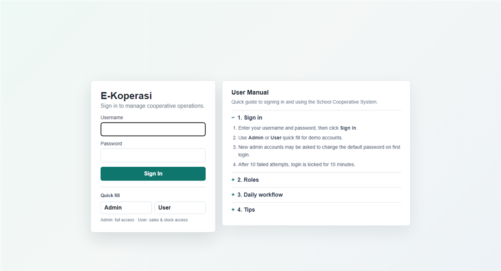
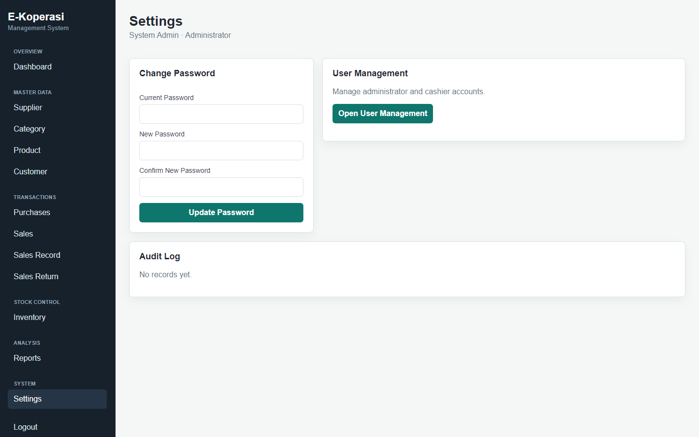

# School Cooperative System

PHP shop system for a school cooperative (E-Koperasi): products, members, POS sales, purchases, inventory, and reports.

The runnable app lives in [`cooperative system/`](cooperative%20system/).

---

## Screenshots

### Login

Admin: `admin` / `admin123` · Staff: `user` / `user1234`



### Dashboard


### Suppliers


### Categories


### Products


### Customers


### Purchases


### Sales


### Sales records


### Inventory


### Reports


### Settings



---

## What you need

- XAMPP (Apache + PHP)
- No MySQL. SQLite is created automatically.

## Step-by-step setup

1. Install XAMPP and start **Apache**.
2. Clone into `htdocs`:
   ```bash
   cd C:\xampp\htdocs
   git clone https://github.com/chewzees/school-cooperative-system.git
   ```
3. Open:
   `http://localhost/school-cooperative-system/cooperative%20system/`
4. The SQLite file is created at `cooperative system/data/cooperative.sqlite` on first run.

Original nested path:

`http://localhost/everything%20that%20work/cooperative_system/cooperative%20system/`

## Step-by-step usage

1. On the login page, click **Admin** quick fill (or type `admin` / `admin123`).
2. Sign in. If asked to change the default password, go to **Settings**, set a new password (8+ characters), and save.
3. Use the sidebar:
   1. **Dashboard** — stock alerts and summary
   2. **Supplier / Category / Product / Customer** — master data (add, then edit)
   3. **Purchases** — record stock-in invoices
   4. **Sales** — POS: add rows, pick products, complete the sale
   5. **Sales Record / Sales Return** — history and returns
   6. **Inventory** — stock in/out
   7. **Reports** — pick a date range
   8. **Expenses** and **Users** (admin only)
4. Staff demo login: `user` / `user1234` (sales and inventory only).
5. Click **Logout** when finished.

## If something goes wrong

- **Too many login attempts:** wait 15 minutes, then try again.
- **Blank page:** confirm PHP can write to `cooperative system/data/`.
