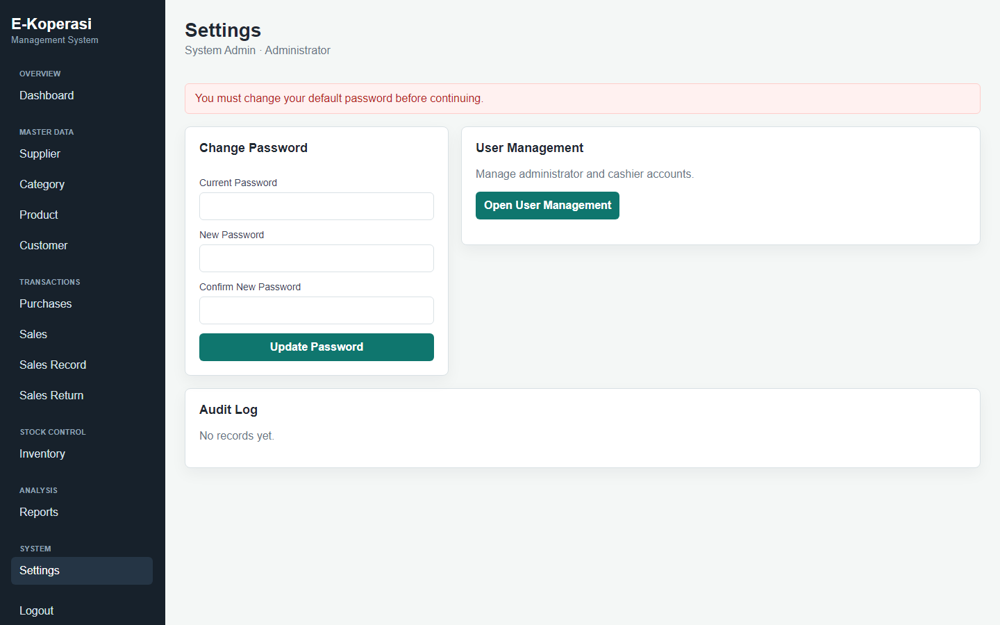

# School Cooperative System

A PHP system for managing a school cooperative shop.

## Screenshots

### Login

### Dashboard

### Suppliers

### Categories

### Products

### Customers

### Purchases

### Sales

### Sales records

### Sales returns

### Inventory

### Reports

### Expenses

### Users

### Settings

## Login

### Administrator
- Username: `admin`
- Password: `admin123`

> **Important:** You will be prompted to change this password on first login.

### Staff / Cashier (demo)
- Username: `user`
- Password: `user1234`

On the login page you can use **Admin** / **User** quick fill, and open the on-page **User Manual**.

New staff accounts are created by an Administrator (no public self-registration).

## Run

Place this folder under XAMPP `htdocs`, start Apache, then open:

`http://localhost/everything%20that%20work/cooperative_system/cooperative%20system/`

The SQLite database is created automatically in `data/cooperative.sqlite`.

## Features

- Dashboard summary with low-stock and out-of-stock alerts
- Member (customer) records with edit support
- Product, category, and supplier management with edit support
- Stock in/out movements with pagination
- Sales point-of-sale with dynamic row addition
- Sales records with search and pagination
- Sales return recording
- Purchase invoices with multi-item entry and dynamic rows
- Expense tracking with preset categories
- Date-range financial reports
- Audit log
- User management (Administrator / Staff roles)

## Security

- CSRF protection on all forms
- Login rate-limiting (10 attempts per 15 min per username)
- Session ID regenerated on login
- Password minimum 8 characters enforced
- Forced password change for new accounts
- Input length capped server-side
